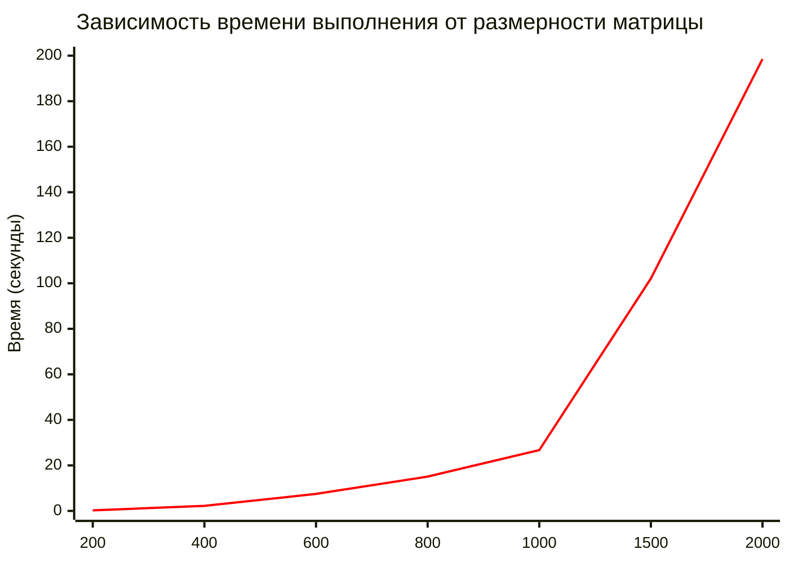

# MatrixMultiplication
Данная работа реализует умножение квадратных матриц на C++ с автоматической верификацией результатов с помощью Python (NumPy).
# Исследование зависимости времени от размера матрицы

<table>
  <tr><th>Размер матрицы (N)</th><th>Время обработки (сек.)</th><th>Количество операций (ед.)</th></tr>
  <tr><td>200</td><td>0,26</td><td>16 млн</td></tr>
  <tr><td>400</td><td>2,23</td><td>128 млн</td></tr>
  <tr><td>600</td><td>7,47</td><td>432 млн</td></tr>
  <tr><td>800</td><td>15,1</td><td>1024 млн</td></tr>
  <tr><td>1000</td><td>26,7</td><td>2 млрд</td></tr>
  <tr><td>1500</td><td>102,1</td><td>6,75 млрд</td></tr>
  <tr><td>2000</td><td>198,5</td><td>16 млрд</td></tr>
</table>

# График к полученным данным

# Вывод
Экспериментальные данные подтверждают теоретическую оценку сложности алгоритма O(n³) и демонстрируют предсказуемый рост времени выполнения, что позволяет планировать вычислительные ресурсы для задач различных размерностей.
